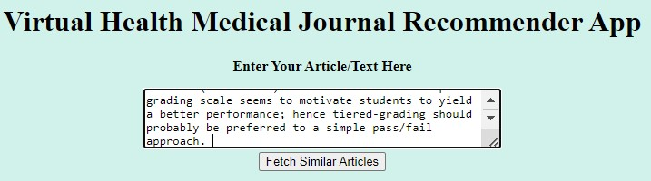
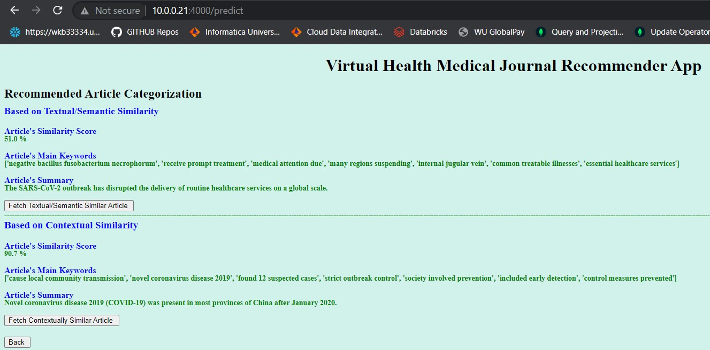
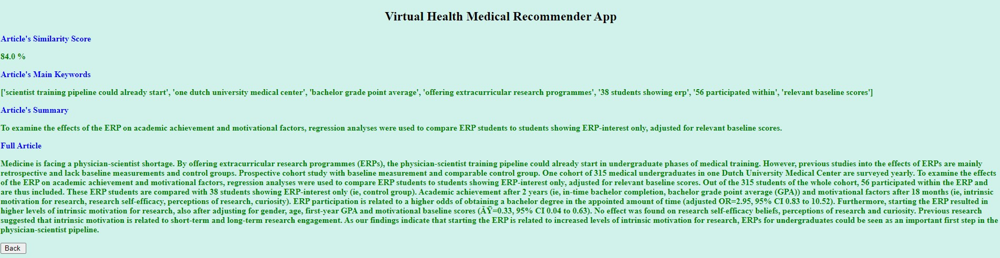

<h1 align="center"> Virtual Health Medical Journals Analysis </h1>  

  

This project utilizes Text Mining Techniques to recommend Articles Textually, Contextually & based on Topics similarity for the Medical Research using abstracts from the Virtual Health Library database.

## Introduction

The primary purpose is to build a web application platform for article recommendation that will easily help medical researchers to search for articles. The results of the search, either with a keyword or a journal will, allow user to choose from the Articles based on Categorization of Results.

### Models

Following are the three models utilized for this project:

* Latent Dirichlet Allocation (LDA) Multicore 
* Latent Semantic Indexing (LSI)
* BERT NLI Sequence Transformer

### Latent Dirichlet Allocation (LDA) Multicore

This module allows both LDA model estimation from a training corpus and inference of topic distribution on new, unseen documents. LDA Multicore provides a faster implementation, especially for exceptionally large corpora as in this case. Following is the model representation.

  

### Latent Semantic Indexing (LSI) Model

LSI is based on the principle that words that are used in the same contexts tend to have similar meanings. A key feature of LSI is its ability to extract the conceptual content of a body of text by establishing associations between those terms that occur in similar contexts.

  

### BERT NLI Sentence Transformer

This is a type of Hugging Face transformers [24] typically used for natural language processing. Input for this model is the list of abstract that are cleaned during the data preprocessing.

  

### Web Application - Article Recommender

Based on the above three models, an article recommendation web application is developed. As an input for this application, entire article or just keyword can be taken into consideration.

* Home Page:

* Topic Page:

* Result Page:

